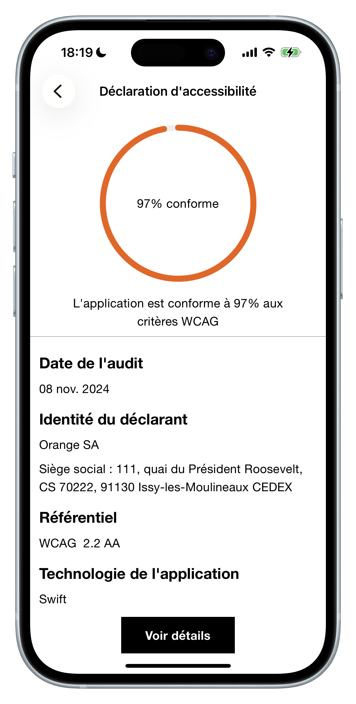
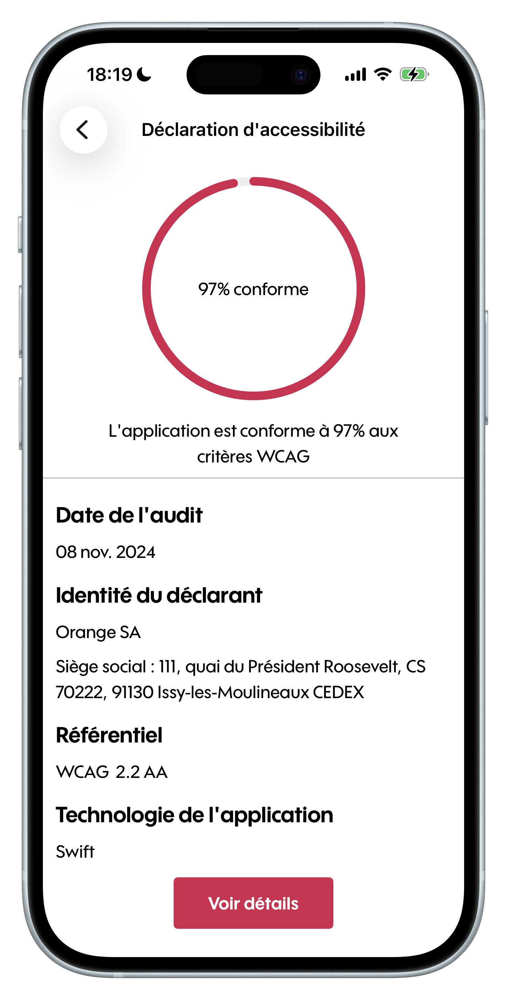
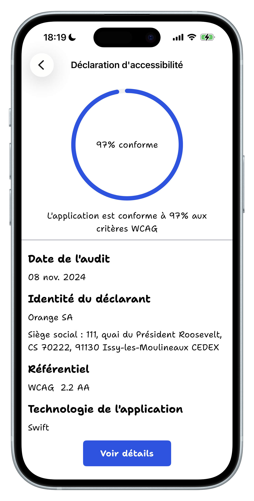

<h1 align="center">Accessibility Statement Lib iOS</h1>

<p align="center">
  Accessibility Statement Lib iOS contains a view showing the WCAG compliance status for a given iOS application.
  <br>
  <a href="https://github.com/Orange-OpenSource/accessibility-statement-lib-ios/issues/new?template=bug_report.yml" title="Open an issue on GitHub">Report bug</a>
  ·
  <a href="https://github.com/Orange-OpenSource/accessibility-statement-lib-ios/issues/new?template=feature_request.yml" title="Open an issue on GitHub">Request feature</a>
</p>

<p align="center">
<a href="https://github.com/Orange-OpenSource/accessibility-statement-lib-ios/actions/workflows/gitleaks.yml" title="Gitleaks status"></a>
&nbsp;
<a href="https://github.com/Orange-OpenSource/accessibility-statement-lib-ios/actions/workflows/lint.yml" title="SwiftLint status"></a>
&nbsp;
<a href="https://github.com/Orange-OpenSource/accessibility-statement-lib-ios/actions/workflows/wordings.yml" title="SwiftPolyglot status"></a>
&nbsp;
<a href="https://github.com/Orange-OpenSource/accessibility-statement-lib-ios/actions/workflows/tests.yml" title="Tests status"></a>
</p>

## ⚙️ Status

[](https://github.com/Orange-OpenSource/accessibility-statement-lib-ios/blob/master/LICENSE)

[](https://github.com/Orange-OpenSource/accessibility-statement-lib-ios/releases)
[](https://github.com/Orange-OpenSource/accessibility-statement-lib-ios/issues?q=is%3Aissue+is%3Aclosed)

[](https://github.com/Orange-OpenSource/accessibility-statement-lib-ios)
[](https://github.com/Orange-OpenSource/accessibility-statement-lib-ios/issues)

[](https://swiftpackageindex.com/Orange-OpenSource/accessibility-statement-lib-ios)

[](https://openhub.net/p/accessibility-statement-lib-ios)

> [!CAUTION]
> To use it, you need the XML accessibility result file from the [Orange Va11ydette](https://la-va11ydette.orange.com/)

<p align="center">

&nbsp;

&nbsp;

<!-- Not relevant maybe to display Orange Business Tools here because looks like a lot the Orange theme but smaller -->
</p>

## 🚀 Import Accessibility Statement lib in your project

1. To integrate the `DeclarationAccessibility` module into your Xcode project using _Swift Package Manager_, declare a new dependency:

```swift
.package(url: "https://github.com/Orange-OpenSource/accessibility-statement-lib-ios.git", .exact("2.0.0"))
```

2. Then add the dependency product in the target you want:

```swift
.target(
    name: "YourTargetName",
    dependencies: [
        .product(name: "DeclarationAccessibility", package: "accessibility-statement-lib-ios")
    ],
)
```

> [!TIP]
> You can of course refer to it in your Xcode project settings.

## 🚀 Usage

Import the module from the Swift Package:

```swift
import DeclarationAccessibility
```

Then, given an XML file generated by [La Va11ydette](https://la-va11ydette.orange.com/) named `accessibility_result` in your app bundle:

- Display the statement with additional details in local HTML file
```swift
StatementView(xmlFile: "accessibility_result", theme: .orange, localUrl: absoluteStringUrlToLocalFile)
```

- Or use a detailed page available outside the app, e.g. in web site, to display in webview or not (by default not)
```swift
StatementView(xmlFile: "accessibility_result", theme: .orange, remoteUrl:  "https://a11y-guidelines.orange.com/fr/", useWebView: true)
```

## 🪲 Bugs, feature requests and discussions

Have a bug or a feature request? Please first search for existing and closed issues. If your problem or idea is not addressed yet, [please open a new issue](https://github.com/Orange-OpenSource/accessibility-statement-lib-ios/issues/new/choose).

If you want to share ideas or discuss about API, features, components or other topics, you should first open a new discussion.
[Q&A](https://github.com/Orange-OpenSource/accessibility-statement-lib-ios/discussions/categories/q-a) is more dedicated for help, otherwise feel free to open or update a topic in [Ideas](https://github.com/Orange-OpenSource/accessibility-statement-lib-ios/discussions/categories/ideas).
Keep in mind internal or sensitive discussions must be in internal tools, not public ones.

## 🤝 Contributing

Please read through our [contributing guidelines](https://github.com/Orange-OpenSource/accessibility-statement-lib-ios/blob/master/.github/CONTRIBUTING.md). Included are directions for opening issues, coding standards, and notes on development. More technical details are available also in the [DEVELOP](https://github.com/Orange-OpenSource/accessibility-statement-lib-ios/blob/master/.github/DEVELOP.md) file.

## 🔒 Data and privacy

The Accessibility Statement Lib is a Software Development Kit (SDK) that allows developpers display accessibility statement.
As such:
- this SDK does not handle any personnal data
- this SDK does not require any device permission to work

## ⚖️ Copyright and license

Code released under the [Apache 2.0 License](https://github.com/Orange-OpenSource/accessibility-statement-lib-ios/blob/master/LICENSE).
