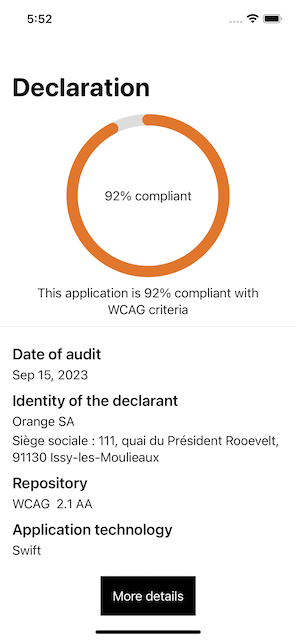

# DeclarationAccessibility

Accessibility Statement Library contains a view showing the WCAG compliance status for its iOS application.

To use it, you need the XML accessibility result file from the [Orange va11ydette](https://la-va11ydette.orange.com/)




Import Accessibility Statement lib in your project
------

1. To integrate DeclarationAccessibility into your Xcode project using Swift Package Manager

```
https://github.com/Orange-OpenSource/accessibility-statement-lib-ios.git"
```

2. Add this line in Package.swift

```
dependencies: [.package(url: "https://github.com/Orange-OpenSource/accessibility-statement-lib-ios.git", .branch("master"))

],

    targets: [

        .target(

            name: "OrangeDesignSystem",

            dependencies: [.product(name: "DeclarationAccessibility", package: "accessibility-statement-lib-ios")],
```


Usage
-----
```swift
DeclarationView(xmlFileName: "accessibility_result", selectedTheme: .orange, url: "https://a11y-guidelines.orange.com/fr/")
```

* Add the results XML file from the va11ydette in racine folder of your project and rename it "accessibility_result.xml"
* Add xmlFileName, selectedTheme and url to DeclarationView


Exemple
-----

1. To integrate DeclarationView
```swift
import SwiftUI
import DeclarationAccessibility

struct SwiftUIView: View {
    var body: some View {
        VStack {
            DeclarationView(xmlFileName: "accessibility_result", selectedTheme: .orange, url: "https://a11y-guidelines.orange.com/fr/")
        }
    }
}

struct SwiftUIView_Previews: PreviewProvider {
    static var previews: some View {
        SwiftUIView()
    }
}
```


